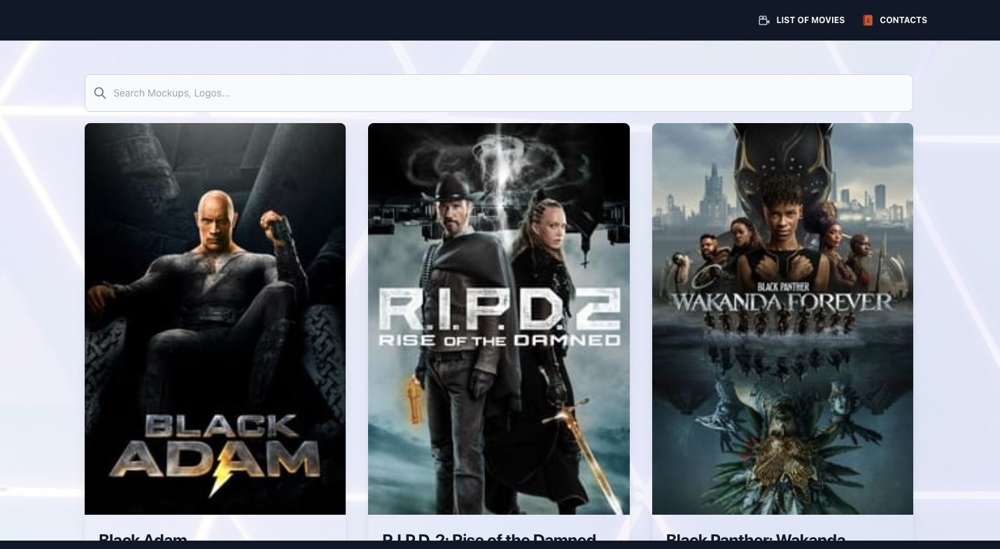
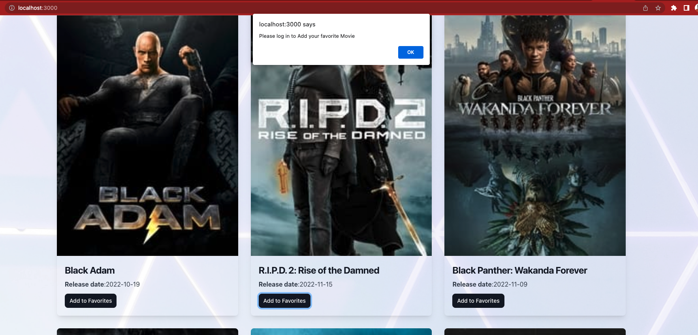
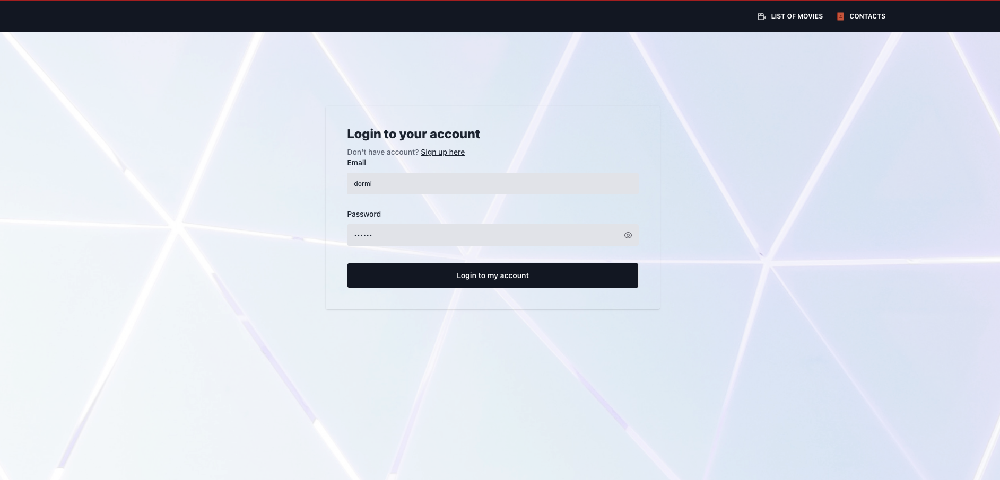
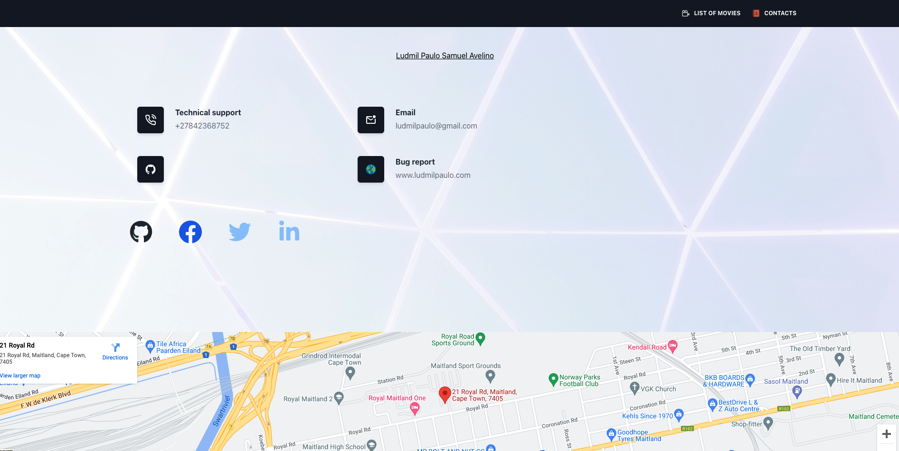

# The-Movie-Database-API

Django Backend React Typescript frontend 

this project will show the interfaces that will showcase content from The Movie Database API

## Stack

- [React](https://reactjs.org/) - A JavaScript library for building user interfaces.
- [Django](https://www.djangoproject.com/) - Django makes it easier to build better web apps more quickly and with less code.
- [Typescript](https://www.typescriptlang.org/) - JavaScript with syntax for types.

# Setup

[make sure you have downloaded and  installed Python in your machine](https://www.python.org/downloads/) 
[make sure you have downloaded and  installed NodeJs in your machine](https://nodejs.org/en/) 

- Clone Repo. 
`git clone https://github.com/ludmilpaulo/The-Movie-Database-API.git` 

- Make sure to navigate inside the folder The-Movie-Database-API in your command line and run the following command to activate the virtual environment   
`source my_env/bin/activate`

- Navigate back to the folder The-Movie-Database-API using the command  
  `cd..`
 
- Navigate in the folder backend with the following command 
`cd backend`

- When inside the backend folder in your terminal run  `python3 manage.py runserver` 

When the back-end is running we will need other terminal to run the front end in different port would advise using the vs code terminal 
cd into the folder the_movie_api then  run npm start  

## Screashoots

